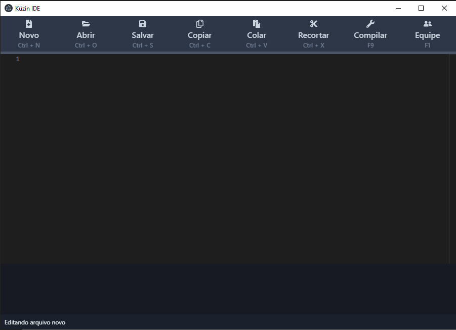

# Küzin

[Link para executável](https://compiladores.s3-sa-east-1.amazonaws.com/kuzin.rar)

## Desenvolvimento

Instale: `NodeJs` e `Yarn`;
Depois: rode `yarn install` na pasta raiz e `yarn start` para iniciar o aplicativo.

## Tecnologias utilizadas

- Electron;
- React;
- Typescript;
- Chakra UI.